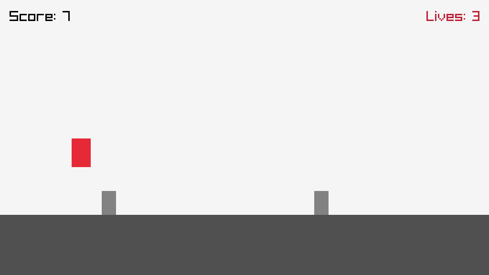

# Runner — Session 4 (Raylib graphics)

A red player on the ground jumps over grey obstacles scrolling from the right.
1024×576 window, 60 fps, 3 lives, GAME OVER after 3 collisions.



## Controls

| Key   | Action                        |
|-------|-------------------------------|
| Space | Jump                          |
| Enter | Play again after GAME OVER    |
| Esc   | Quit the window               |

Score: +1 for every obstacle that leaves the screen without hitting the player.

## Build and run

You only need CMake (3.16 or newer) and a C++17 compiler. Raylib 5.5 is downloaded
by CMake (`FetchContent`) the first time you configure: that step needs Internet
access and takes about a minute. Nothing else to install.

### Command line (all systems)

```bash
cmake -S . -B build
cmake --build build
```

Then run the game:

| System                          | Command                       |
|---------------------------------|-------------------------------|
| Linux / macOS / Windows (MinGW) | `./build/runner`              |
| Windows (Visual Studio)         | `build\Debug\runner.exe`      |

### IDEs

- **CLion**: *File → Open* the project folder, wait for CMake to finish, then Run `runner`.
- **Visual Studio 2022**: *File → Open → Folder*, pick `runner.exe` as startup item, then Run.
- **VS Code**: install the *CMake Tools* extension, open the folder, then *CMake: Build* and *CMake: Run Without Debugging*.

### Extra packages

- **Linux** needs the X11/OpenGL headers:
  ```bash
  sudo apt install libx11-dev libxrandr-dev libxinerama-dev libxcursor-dev libxi-dev libgl1-mesa-dev
  ```
- **macOS** needs the command line tools: `xcode-select --install`.
- **Windows**: nothing more than Visual Studio (with *Desktop development with C++*) or MinGW.

## Structure

The Board / Player / main split from session 3 stays in place: Board renders, Player holds the game logic.

| File                      | Role                                                                                                     | Lab steps      |
|---------------------------|----------------------------------------------------------------------------------------------------------|----------------|
| `CMakeLists.txt`          | FetchContent block for Raylib 5.5, `runner` target linked to `raylib`                                    | A2, A3         |
| `Board.h` / `Board.cpp`   | Window constants, `Position` in floats, pixel constants, `displayState` / `displayGameOver` (rendering)  | B1, C1–C4      |
| `Player.h` / `Player.cpp` | `handleInput` (`IsKeyPressed(KEY_SPACE)`), `updateJump` (gravity + landing), `checkCollision`            | D1, D2, D5     |
| `main.cpp`                | Raylib loop, obstacle scrolling (px/s), spawning every 1.5 s, collisions, score, lives, restart          | B2, C5, D3, D4 |
